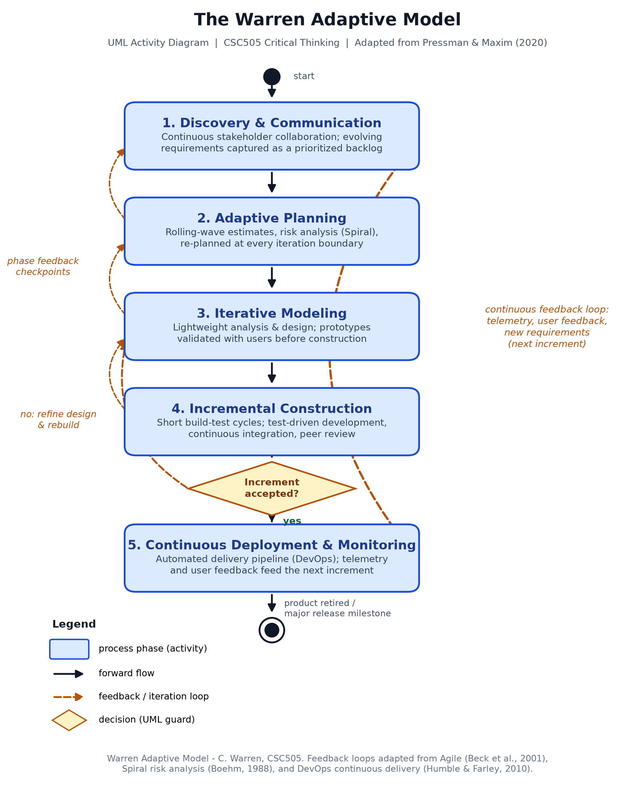
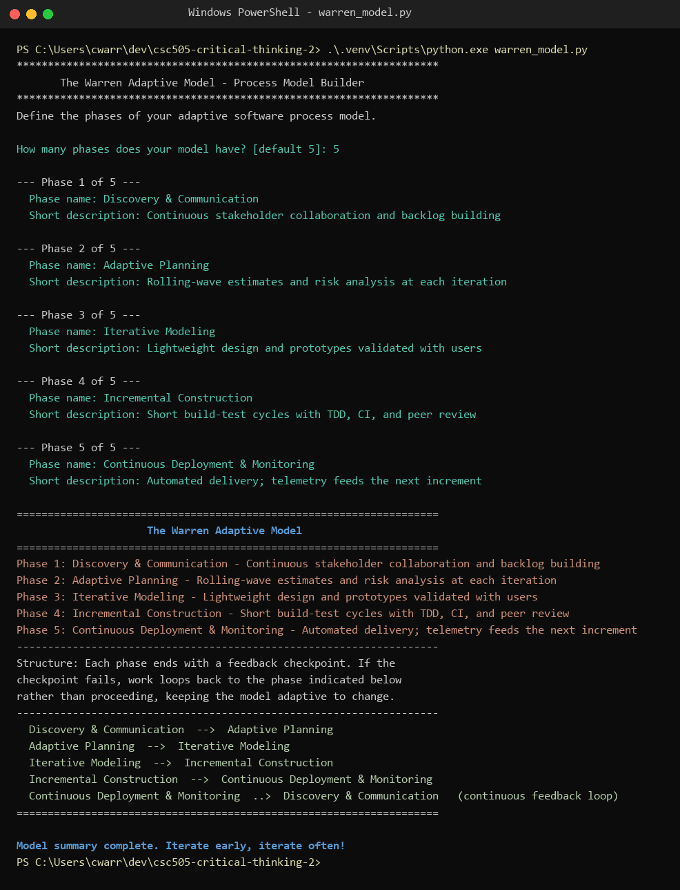

# CSC505 Critical Thinking Assignment 2: The Warren Adaptive Model

An evaluation of the traditional Waterfall Model (Pressman & Maxim, 2020) and the
design of a modernized process model, the **Warren Adaptive Model**, which keeps
Waterfall's five-phase structure but embeds feedback loops from Agile, Spiral,
and DevOps practices.

**Author:** C. Warren  
**Course:** CSC505 - Principles of Software Development  
**Repository:** https://github.com/cwarrendev/csc505-critical-thinking-2

## Contents

| File | Description |
| --- | --- |
| `Warren_Waterfall_Evaluation.docx` | Written evaluation of the Waterfall Model's limitations and the design rationale for the Warren Adaptive Model, with APA references |
| `warren_adaptive_model_uml.png` | UML activity diagram of the Warren Adaptive Model (phases, decision gates, feedback loops) |
| `warren_adaptive_model.puml` | PlantUML source for the UML diagram (render with `java -jar plantuml.jar -tpng warren_adaptive_model.puml`) |
| `warren_model.py` | Interactive Python script that prompts for each phase name/description and prints a formatted model summary |
| `screenshots/warren_model_execution_screenshot.png` | Screenshot of a successful program run |

## The Warren Adaptive Model

Five phases, each ending in a feedback checkpoint rather than a one-way gate:

1. **Discovery & Communication** - continuous stakeholder collaboration; evolving requirements captured as a prioritized backlog
2. **Adaptive Planning** - rolling-wave estimates and Spiral-style risk analysis, re-planned at every iteration boundary
3. **Iterative Modeling** - lightweight analysis and design; prototypes validated with users before construction
4. **Incremental Construction** - short build-test cycles with TDD, continuous integration, and peer review, followed by an "increment accepted?" decision gate
5. **Continuous Deployment & Monitoring** - automated delivery pipeline; production telemetry and user feedback feed the next increment's backlog

### UML activity diagram



## Running the script

The script uses only the Python standard library (Python 3.9+):

```powershell
python warren_model.py
```

This repo also includes a [uv](https://docs.astral.sh/uv/)-managed virtual
environment used to generate the diagram and document:

```powershell
uv venv
uv pip install matplotlib pillow python-docx
.\.venv\Scripts\python.exe warren_model.py
```

At the prompts, enter the number of phases (Enter accepts the default of 5),
then a name and short description for each phase. The program prints a
formatted summary of the phases and the model's flow structure, e.g.:

```
Phase 1: Discovery & Communication - Continuous stakeholder collaboration and backlog building
Phase 2: Adaptive Planning - Rolling-wave estimates and risk analysis at each iteration
...
  Continuous Deployment & Monitoring  ..>  Discovery & Communication   (continuous feedback loop)
```

### Example run



## References

- Beck, K., et al. (2001). *Manifesto for agile software development.* https://agilemanifesto.org/
- Boehm, B. W. (1988). A spiral model of software development and enhancement. *Computer, 21*(5), 61–72.
- Humble, J., & Farley, D. (2010). *Continuous delivery.* Addison-Wesley.
- Petersen, K., Wohlin, C., & Baca, D. (2009). The waterfall model in large-scale development. In *PROFES 2009* (pp. 386–400). Springer.
- Pressman, R. S., & Maxim, B. R. (2020). *Software engineering: A practitioner's approach* (9th ed.). McGraw-Hill Education.
- Royce, W. W. (1970). Managing the development of large software systems. *Proceedings of IEEE WESCON, 26*, 1–9.
